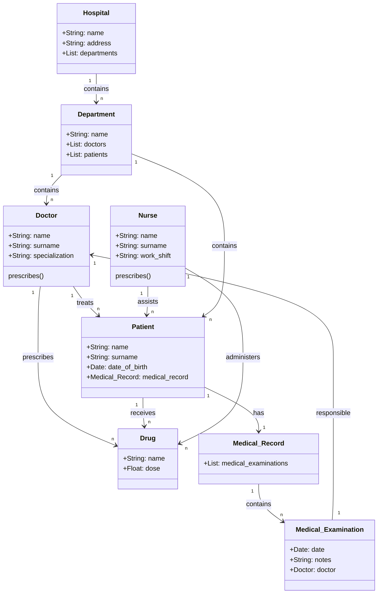

## Esercizio UML

### Obiettivo

Si desidera modellare un sistema di gestione di un ospedale. Il sistema deve includere diverse entità con i loro attributi e relazioni.

### Istruzioni

Creare un diagramma UML delle classi utilizzando la sintassi di MermaidJS. Consegnare un file markdown con il diagramma UML in un blocco mermaid.

### Descrizione

In un ospedale, ci sono medici che trattano pazienti. Ogni medico ha un nome, un cognome e una specializzazione. I medici possono prescrivere farmaci, che hanno un nome e una dose. Ogni farmaco può essere prescritto da più medici.

L'ospedale ha un nome e un indirizzo e contiene molti reparti. Ogni reparto ha un nome e può avere più medici e pazienti. I pazienti hanno un nome, un cognome e una data di nascita. Ogni paziente può essere trattato da più medici e può ricevere più farmaci.

L'ospedale ha anche infermieri, che assistono i medici e i pazienti. Ogni infermiere ha un nome, un cognome e un turno di lavoro. Gli infermieri possono somministrare farmaci ai pazienti.

Ogni paziente può avere una cartella clinica, che contiene una lista di visite mediche. Ogni visita medica ha una data, un medico responsabile e delle note.

### Compito

Identificare le classi, gli attributi e le associazioni necessarie per modellare questo sistema e creare il diagramma UML delle classi.

