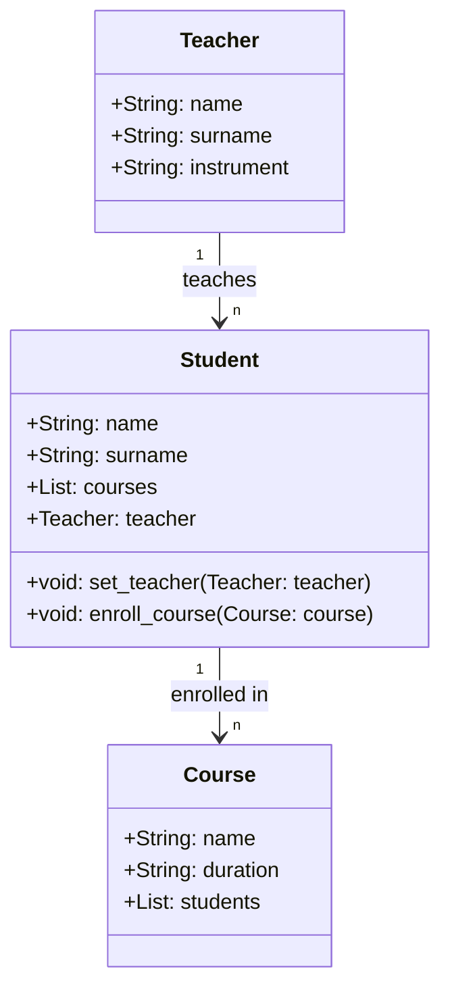

## Esercizio UML e Codice

### Obiettivo

Si desidera modellare un sistema di gestione di una scuola di musica. Il sistema deve includere diverse entità con i loro attributi e relazioni.

### Istruzioni

1. Creare un diagramma UML delle classi utilizzando la sintassi di MermaidJS. Consegnare un file markdown con il diagramma UML in un blocco mermaid.
2. Implementare il codice Python dell'esercizio utilizzando la programmazione orientata agli oggetti (OOP).

### Descrizione

In una scuola di musica, ci sono insegnanti e studenti. Ogni insegnante ha un nome, un cognome e uno strumento musicale che insegna. Ogni insegnante può insegnare a più studenti, ma ogni studente ha un solo insegnante.

Gli studenti hanno un nome, un cognome e una lista di corsi a cui sono iscritti. Ogni corso ha un nome e una durata. Gli studenti possono iscriversi a più corsi e ogni corso può avere più studenti iscritti.

