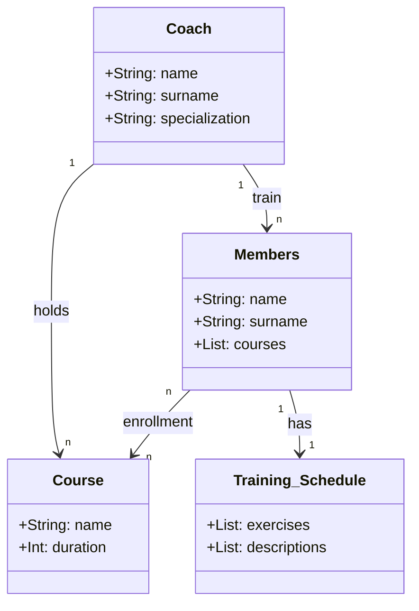

## Esercizio UML e Codice

### Obiettivo

Si desidera modellare un sistema di gestione di una palestra. Il sistema deve includere diverse entità con i loro attributi e relazioni.

### Istruzioni

1. Creare un diagramma UML delle classi utilizzando la sintassi di MermaidJS. Consegnare un file markdown con il diagramma UML in un blocco mermaid.
2. Implementare il codice Python dell'esercizio utilizzando la programmazione orientata agli oggetti (OOP).

### Descrizione

In una palestra, ci sono allenatori, membri e corsi. Ogni allenatore ha un nome, un cognome e una specializzazione. Ogni allenatore può allenare più membri, ma ogni membro ha un solo allenatore.

I membri hanno un nome, un cognome e una lista di corsi a cui sono iscritti. Ogni corso ha un nome e una durata. I membri possono iscriversi a più corsi e ogni corso può avere più membri iscritti.

Ogni corso è tenuto da un solo allenatore, ma un allenatore può tenere più corsi.

Ogni membro ha una scheda di allenamento. La scheda di allenamento contiene una lista di esercizi e la loro descrizione. Ogni membro ha una sola scheda di allenamento e ogni scheda di allenamento appartiene a un solo membro.

