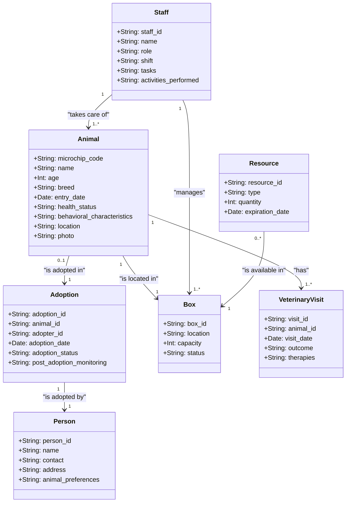

## Esercizio UML

### Obiettivo

Si desidera modellare un sistema di gestione di un canile.

### Istruzioni

1. Creare un diagramma UML delle classi utilizzando la sintassi di MermaidJS. Consegnare un file markdown con il diagramma UML in un blocco mermaid.

## Requisiti Funzionali Sistema Gestione Canile

### 1. Gestione Animali

- Registrazione nuovo animale (codice microchip, nome, età, razza, data ingresso)
- Gestione stato di salute (vaccinazioni, visite veterinarie)
- Gestione caratteristiche comportamentali
- Tracking posizione nel canile (box/area)
- Upload e gestione foto dell'animale

### 2. Gestione Adozioni

- Registrazione potenziali adottanti
- Processo di matching animale-adottante
- Gestione pratiche di adozione
- Monitoraggio post-adozione
- Storico adozioni

### 3. Gestione Struttura

- Mappatura box/aree disponibili
- Gestione capacità e occupazione
- Manutenzione strutture
- Inventario risorse (cibo, medicinali)

### 4. Gestione Personale

- Turni dipendenti/volontari
- Assegnazione mansioni
- Tracciamento attività svolte

### 5. Gestione Sanitaria

- Calendario vaccinazioni
- Registro visite veterinarie
- Gestione terapie in corso
- Gestione emergenze

### 6. Report e Statistiche

- Report mensili presenze animali
- Statistiche adozioni
- Monitoraggio costi/risorse
- Dashboard indicatori principali

### Requisiti Non Funzionali

- Interfaccia user-friendly
- Backup giornaliero dati
- Conformità GDPR
- Multi-utente con livelli di accesso
- Log delle operazioni
- Tempi di risposta < 2 secondi
- Disponibilità sistema 99.9%

