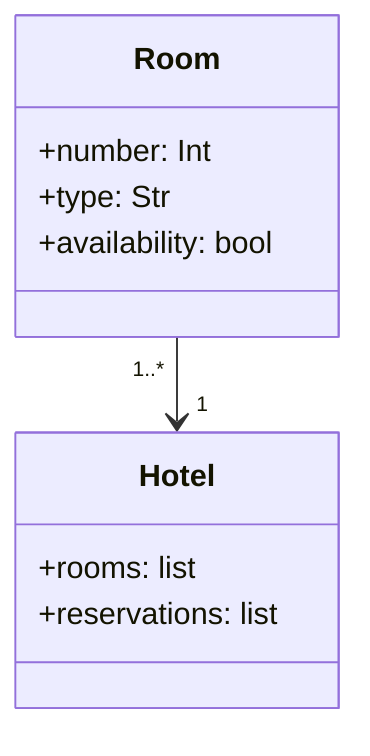

Descrizione dell'esercizio:
il sistema permette di gestire le prenotazioni in un albergo.
L'albergo ha diverse camere, e ogni camera ha un numero, un tipo (singola, doppia, suite) e una disponibilità (occupata o libera).
Il sistema deve permettere di:

- Aggiungere nuove camere all'albergo.
- Prenotare una camera (verificando se è disponibile).
- Visualizzare le camere disponibili.
- Visualizzare le prenotazioni effettuate.

Il sistema deve includere due classi principali:
1. Camera: rappresenta una singola camera dell'albergo.
2. Albergo: rappresenta l'albergo che gestisce le camere e le prenotazioni.

Crea relativo diagramma UML

