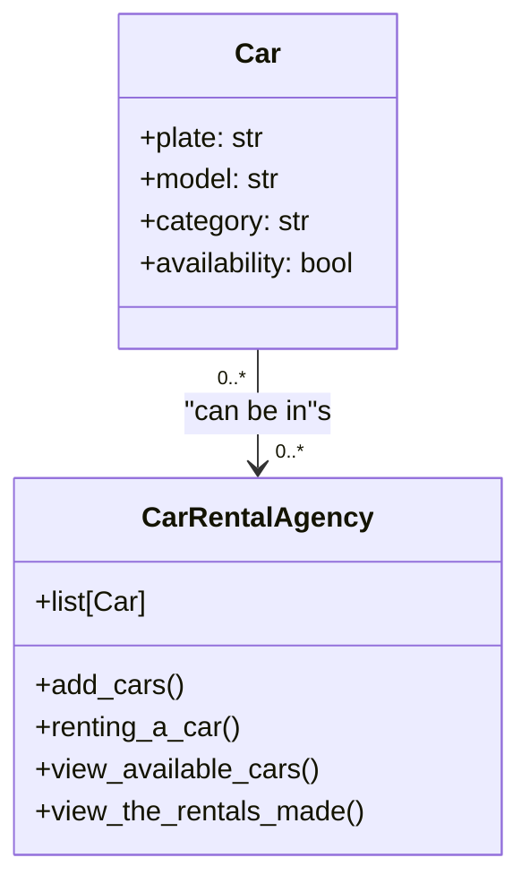

Il sistema permette di gestire il noleggio di automobili presso un'agenzia di autonoleggio.
L'agenzia dispone di diverse automobili, e ogni automobile ha un numero di targa, un modello, una categoria (economica, media, lusso) e una disponibilità (noleggiata o disponibile).
Il sistema deve permettere di:

1.Aggiungere nuove automobili all'agenzia.
2.Noleggiare un'auto (verificando se è disponibile).
3.Visualizzare le automobili disponibili.
4.Visualizzare i noleggi effettuati.

Il sistema deve includere due classi principali:
- Automobile: rappresenta una singola auto disponibile presso l'agenzia.
- AgenziaNoleggio: gestisce le automobili e i noleggi.

Crea relativo diagramma UML

