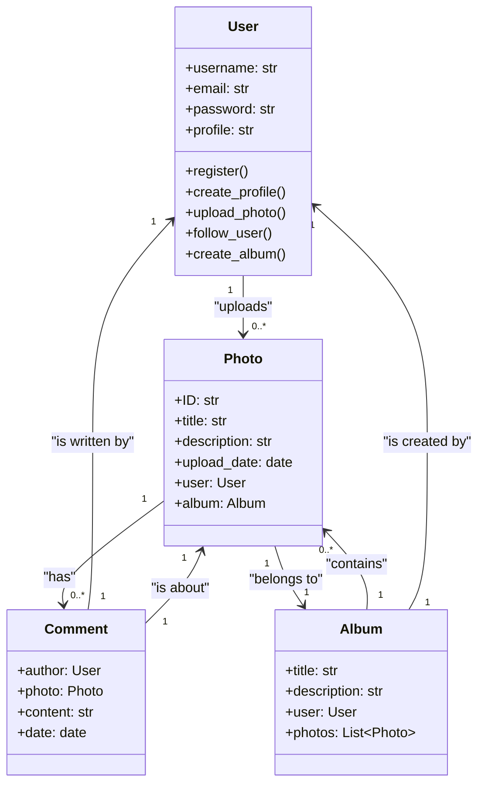

Descrizione dell'esercizio:
Un social network di fotografia (instagram).
Gli utenti possono registrarsi, creare un profilo, caricare foto, seguire altri utenti.
Ogni foto ha un titolo, una descrizione. Gli utenti possono creare album per organizzare le loro foto.

Classi Principali:

Utente: nome utente, email, password, profilo (immagine, biografia)
Foto: ID, titolo, descrizione, data caricamento, utente (chi l'ha caricata), album (a quale album appartiene)
Album: titolo, descrizione, utente (chi l'ha creato), foto (lista di foto)

Relazioni:

Un utente può caricare molte foto (relazione uno-a-molti).
Una foto può avere molti commenti (relazione uno-a-molti).
Un commento appartiene a un utente e a una foto (relazione molti-a-molti).
Una foto appartiene a un album (relazione uno-a-molti).
Un album appartiene a un utente (relazione uno-a-molti).

Crea relativo diagramma UML e codice.

