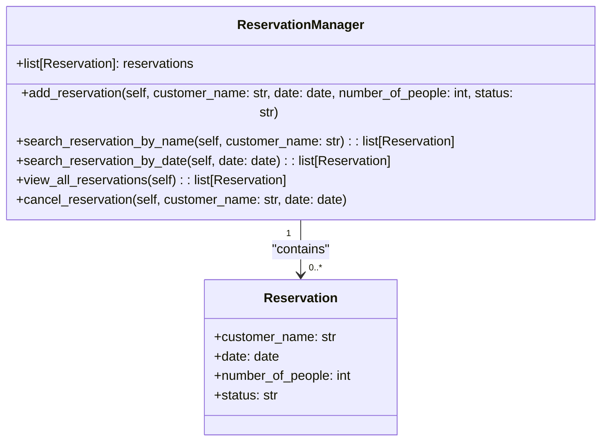

Gestire le prenotazioni in un ristorante.

Ogni prenotazione ha un nome del cliente, una data e ora, un numero di persone e uno stato (confermata, in attesa, cancellata).
Il sistema deve permettere di:

- aggiungere nuove prenotazioni
- cercare prenotazioni per nome del cliente o data
- visualizzare tutte le prenotazioni
- cancellare una prenotazione

Il sistema deve includere due classi principali:
- rappresenta una singola prenotazione nel ristorante
- gestisce le prenotazioni e le operazioni associate

