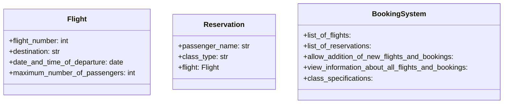

Il sistema permette di gestire le prenotazioni di voli aerei.
Ogni volo ha un numero di volo, una destinazione, una data e ora di partenza e un numero massimo di passeggeri.
Esistono due tipologie di prenotazioni: normale e premium.
Ogni prenotazione può essere aggiunta al sistema e il programma deve consentire di visualizzare le informazioni sui voli e le prenotazioni.

Creare una classe Volo con gli attributi di base:

- numeroVolo
- destinazione
- dataOraPartenza: 
- numeroMassimoPasseggeri

Creare una classe Prenotazione con gli attributi di base:

- nomePasseggero
- tipoClasse
- volo

La classe SistemaPrenotazioni deve gestire:

- una lista di voli.
- una lista di prenotazioni.
- permettere l’aggiunta di nuovi voli e prenotazioni.
- visualizzare le informazioni di tutti i voli e le prenotazioni.
- specifiche delle classi

