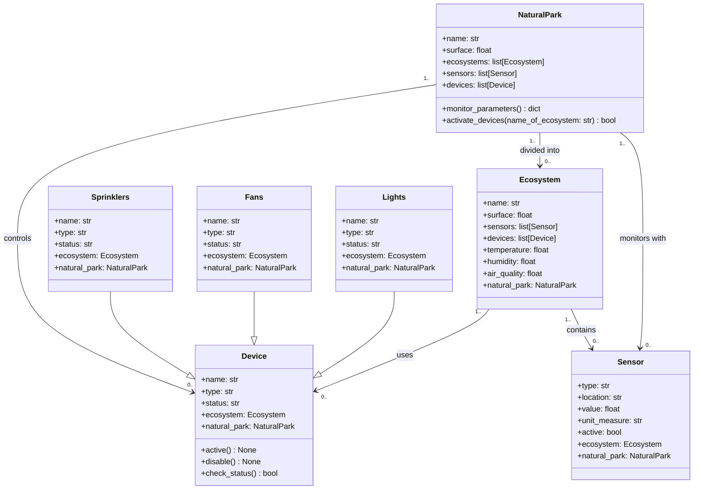

Un'azienda di gestione ecologica ha creato un parco naturale che ospita diversi ecosistemi, tra cui foreste, zone umide e praterie.
Ogni ecosistema ha caratteristiche e esigenze ambientali differenti.
Il parco è dotato di una rete di sensori che monitorano le condizioni ambientali e di dispositivi che possono essere attivati o disattivati per ottimizzare la gestione e preservare l'equilibrio ecologico.
Il sistema deve essere in grado di monitorare costantemente i parametri ambientali e gestire i dispositivi di controllo, come irrigatori per mantenere il livello di umidità, ventilatori per migliorare la qualità dell'aria e luci per illuminare aree specifiche nelle ore notturne
Ogni area del parco deve essere monitorata separatamente.
Ogni area ha caratteristiche ambientali specifiche (temperatura, umidità, qualità dell'aria) e dispositivi dedicati per gestirle.
Il sistema deve monitorare i parametri ambientali in tempo reale per ogni zona e regolare automaticamente l'ambiente, se necessario, per mantenere le condizioni ottimali.
I dispositivi di controllo (irrigatori, ventilatori, luci) devono essere gestiti in base ai dati rilevati dai sensori.
Ogni zona può avere una serie di dispositivi attivi o disattivi, e il sistema deve permettere di monitorare e modificare lo stato di ciascun dispositivo.
Il sistema deve monitorare i parametri ambientali per ciascuna zona (temperatura, umidità, qualità dell'aria).
Il sistema deve attivare o disattivare i dispositivi per ogni zona in base alle necessità: Se la temperatura supera i 30°C, attivare i ventilatori.
Se l'umidità scende sotto il 60%, attivare gli irrigatori.
Se la qualità dell'aria scende sotto il 40%, attivare i ventilatori.
Implementare una funzione che restituisca un dizionario con i parametri di ogni zona, e una che permetta di attivare o disattivare i dispositivi di ciascuna zona.

