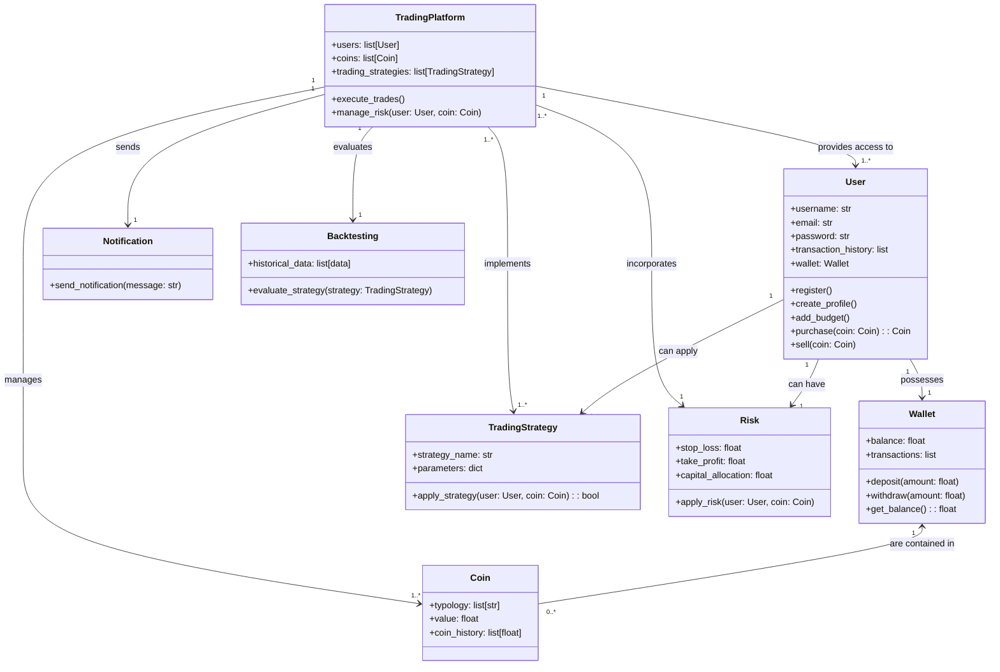

Creare un programma di trading automatizzato che utilizza flussi economici per prendere decisioni d'acquisto e vendita.
Il programma deve implementare strategie di trading semplici e includere funzioni di gestione del rischio.
Crea relativo diagramma UML.

