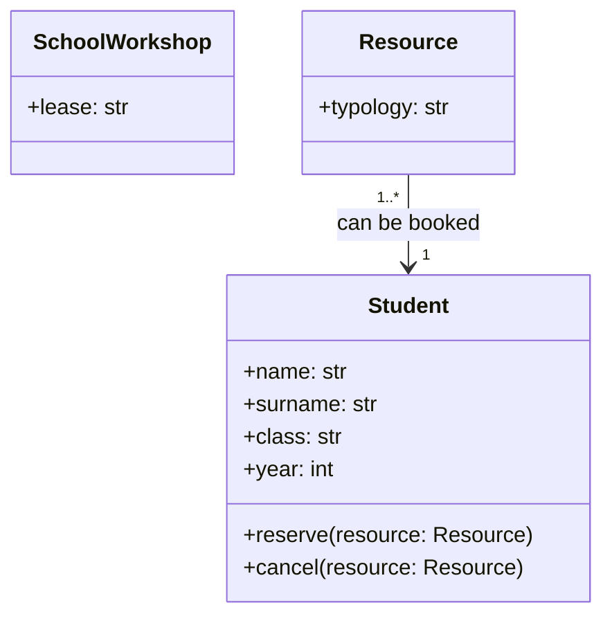

L'obiettivo di questo esercizio è sviluppare un sistema di gestione delle risorse di un laboratorio scolastico, dove gli studenti possono prenotare e annullare la prenotazione di risorse come computer, proiettori e altre attrezzature.
Il sistema dovrà essere in grado di gestire le disponibilità delle risorse, permettere agli studenti di effettuare prenotazioni e annullamenti, e visualizzare lo stato delle risorse in tempo reale.
In un laboratorio scolastico ci sono diverse risorse che gli studenti possono prenotare, come computer, proiettori e altre attrezzature.
Ogni risorsa può essere prenotata da uno studente, ma una volta prenotata non può essere prenotata da un altro studente fino a quando non viene annullata la prenotazione.  

Realizza il relativo diagramma UML

