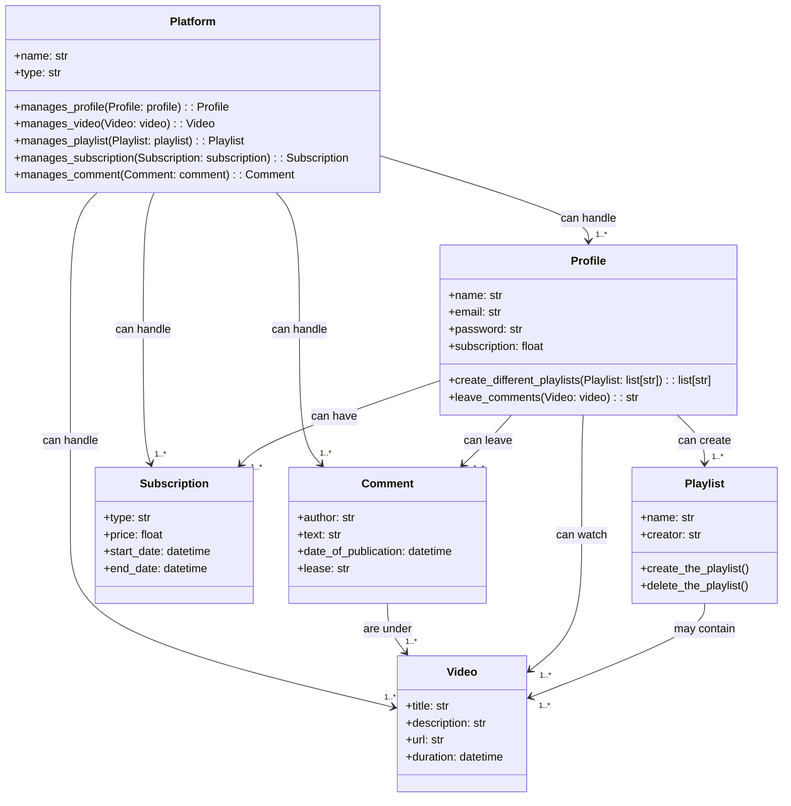

### Piattaforma di Streaming Video

Immagina una piattaforma dove gli utenti possono guardare video, creare playlist e seguire i loro canali preferiti.

Ogni utente ha un suo profilo con nome, email e password, e può creare diverse playlist per organizzare i video che preferisce.
L'utente ha anche un abbonamento che gli permette di accedere a contenuti esclusivi.

I video sono il cuore della piattaforma: hanno un titolo, una descrizione, un URL per lo streaming e una durata.
Sotto ogni video, gli utenti possono lasciare commenti.

Le playlist sono raccolte di video create dagli utenti.
Ogni playlist ha un nome e un creatore, e contiene una lista di video.

Ogni abbonamento ha un tipo, un prezzo e una data di inizio e fine.

I commenti sono messaggi lasciati dagli utenti sotto i video dopo averlo guardato.
Ogni commento ha un autore, un testo, una data di pubblicazione ed è associato a uno specifico video.

In sintesi, la piattaforma gestisce utenti, video, playlist, abbonamenti e commenti, permettendo agli utenti di interagire tra loro e con i contenuti.

