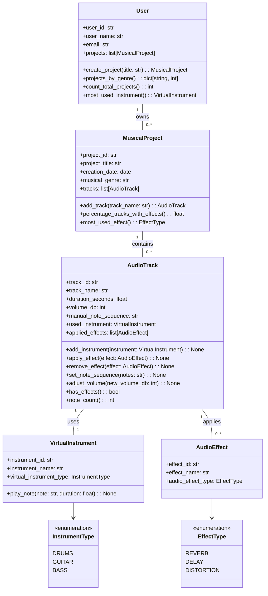

# Applicazione per la Composizione Musicale

# Applicazione per la Composizione Musicale

Si vuole progettare un'applicazione per permettere la composizione musicale. L'applicazione deve gestire progetti musicali, tracce audio, strumenti virtuali ed effetti audio.

## Requisiti

### Gestione Utenti

- Ogni utente è identificato da id, nome utente ed email
- Gli utenti possono creare e gestire più progetti musicali
- Ogni utente mantiene una lista dei propri progetti

### Gestione Progetti

- Ogni progetto ha un identificatore, titolo, data di creazione e genere musicale
- I progetti sono composti da una o più tracce audio
- Ogni progetto appartiene a un singolo utente

### Gestione Tracce Audio

- Ogni traccia ha un identificatore, nome e durata
- Le tracce hanno un controllo del volume in decibel
- Utilizzano uno strumento virtuale
- Utilizzano uno strumento virtuale
- Possono avere più effetti audio applicati
- Supporto per inserimento note musicali in formato testuale
- Le note vengono memorizzate come sequenza di caratteri (es. "C4 D4 E4")
- Funzioni per gestire strumenti ed effetti

### Strumenti Virtuali

- Identificati da id e nome
- Tre tipi disponibili:
  - BATTERIA
  - CHITARRA
  - BASSO
- Capacità di suonare note di durata specificata

### Effetti Audio

- Identificati da id e nome
- Tre tipi di effetto disponibili:
  - RIVERBERO
  - DELAY
  - DISTORSIONE

## Diagramma UML

Il diagramma delle classi è disponibile nel file [e35.mmd](../docs/e35.mmd)
Il diagramma delle classi è disponibile nel file [e35.mmd](../docs/e35.mmd)

### Descrizione delle Classi

- **Utente**: Gestisce gli utenti e i loro progetti musicali
- **ProgettoMusicale**: Contiene le informazioni del progetto e gestisce le tracce
- **TracciaAudio**: Gestisce una singola traccia audio con volume, strumento, effetti e sequenza di note
- **StrumentoVirtuale**: Rappresenta uno strumento musicale virtuale
- **EffettoAudio**: Definisce un effetto audio applicabile alle tracce

### Enumerazioni

- **TipoStrumento**: Definisce i tre tipi di strumenti disponibili
- **TipoEffetto**: Definisce i tre tipi di effetti supportati

## Relazioni

- Un **Utente** possiede zero o più **ProgettoMusicale**
- Un **ProgettoMusicale** contiene zero o più **TracciaAudio**
- Una **TracciaAudio** può utilizzare uno **StrumentoVirtuale**
- Una **TracciaAudio** può avere zero o più **EffettoAudio**

## Metodi Statistici

L'applicazione fornisce diversi metodi per analizzare l'utilizzo e le caratteristiche dei progetti musicali:

### A livello Utente

- `progetti_per_genere()`: Restituisce un dizionario con il conteggio dei progetti per ogni genere musicale
- `conta_progetti_totali()`: Calcola il numero totale di progetti dell'utente
- `strumento_piu_usato()`: Identifica lo strumento virtuale più utilizzato nei progetti dell'utente

### A livello Progetto

- `percentuale_tracce_con_effetti()`: Calcola la percentuale di tracce che hanno almeno un effetto applicato
- `effetto_piu_usato()`: Identifica il tipo di effetto più frequentemente utilizzato nel progetto

### A livello Traccia

- `ha_effetti()`: Verifica se la traccia ha effetti audio applicati

## Note sul formato delle note musicali

La sequenza di note può essere specificata in un formato semplice come:

- Note separate da spazi: "C4 D4 E4 F4 G4 A4 B4"
- Dove ogni nota è composta da:
  - La lettera della nota (C, D, E, F, G, A, B)
  - L'ottava (es. 4 per l'ottava centrale)

