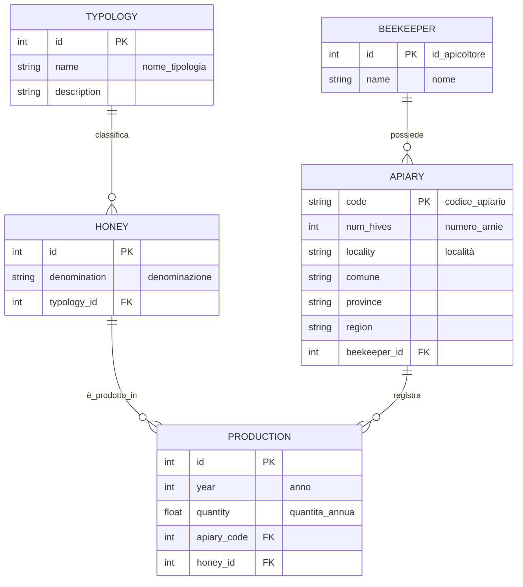

1. Creare le tabelle del modello ER
2. Inserire dati nelle tabelle con le istruzioni di INSERT (2-3 righe per tabella)
3. Fare le seguenti query:
    - Seleziona tutti gli apicoltori.
    - Seleziona il nome dell'apicoltore con id = 1.
    - Seleziona tutti gli apiari nella regione 'Lombardia'.
    - Seleziona codice e numero_arnie degli apiari con più di 10 arnie.
    - Seleziona codice e località degli apiari posseduti dall'apicoltore con id = 2.
    - Seleziona tutti i mieli appartenenti alla tipologia con id = 3.
    - Seleziona la denominazione del miele con id = 5.
    - Seleziona tutte le produzioni dell'anno 2024.
    - Seleziona tutte le produzioni per l'apiario con codice = '102'.
    - Seleziona le produzioni per il miele con id = 3 nell'anno 2023.

