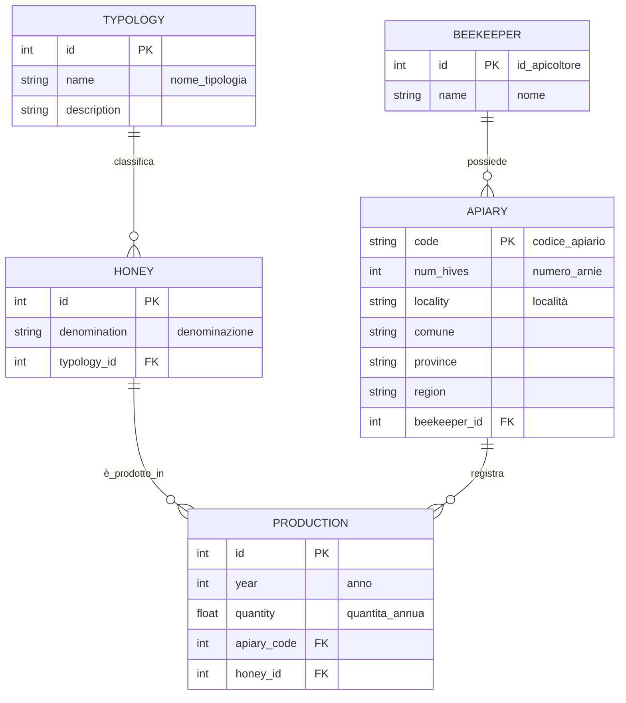

# Query con GROUP BY e funzioni aggregate

```sql

-- Seleziona la quantità totale prodotta per anno.
-- Seleziona la produzione media per apiario.
-- Seleziona il numero di produzioni e la produzione totale per miele.
-- Seleziona la produzione totale per miele nell'anno 2024.
-- Seleziona il valore massimo e minimo di produzione per anno.
-- Seleziona gli apiari la cui produzione totale supera 200.
-- Seleziona la produzione totale per tipologia di miele (typology_id).
-- Seleziona il numero di mieli per ciascuna tipologia.
-- Seleziona la produzione totale per apicoltore (beekeeper_id).
-- Seleziona la produzione media per arnia (produzione totale divisa per num_hives) per apiario.
-- Seleziona per ogni anno il conteggio delle produzioni con quantità maggiore di 100.
-- Seleziona per ogni miele e anno la somma delle quantità.
```

