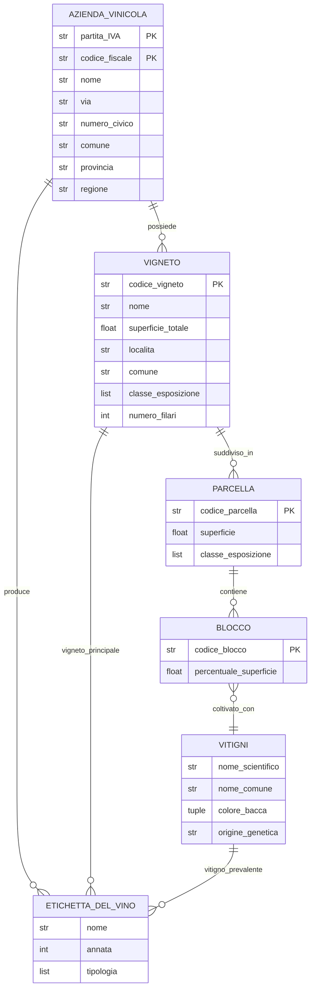

L'Italia è uno dei maggiori produttori di vino al mondo; numerose denominazioni, vitigni autoctoni e tradizioni locali caratterizzano il territorio. Il progetto prevede la realizzazione di una banca dati per la raccolta, gestione e consultazione dei dati relativi alle aziende vinicole e alle produzioni dei loro vigneti.

Per consentire una modellazione coerente sono state individuate le seguenti informazioni e vincoli:

- Le aziende vinicole sono identificate da una partita IVA (o codice fiscale) e hanno: nome, via, numero civico, comune, provincia e regione.
- Ogni azienda può possedere più vigneti. Un vigneto è individuato da un codice univoco e annotato con: nome, superficie totale (ettari), località, comune, classe di esposizione (es: "nord", "sud", "est", "ovest") e numero di filari.
- Ogni vigneto è suddiviso in uno o più blocchi (parcelle), ciascuno con un codice identificativo, superficie (ettari), e classe di esposizione. Questa suddivisione permette di rappresentare variazioni locali all'interno dello stesso vigneto.
- I vitigni sono caratterizzati da nome scientifico, nome comune, colore della bacca ("rossa" o "bianca") e origine genetica.
- I vitigni sono piantati a livello di blocco: per ogni blocco si specifica quali vitigni vi sono coltivati e, per ciascuno, la percentuale della superficie del blocco occupata dal vitigno. Questa struttura permette composizioni diverse tra blocchi dello stesso vigneto.
- Le etichette di vino rappresentano l'unità di produzione commerciale: ogni etichetta ha nome, annata e tipologia (es: "DOC", "IGT", "Vino da Tavola"). Un'etichetta è prodotta da un'azienda, proviene da un vigneto principale e può essere associata a un vitigno prevalente.

Si richiede di modellare il dominio mediante un diagramma ER in cui siano chiaramente rappresentate entità, attributi (con chiavi primarie e chiavi esterne), relazioni e cardinalità.

