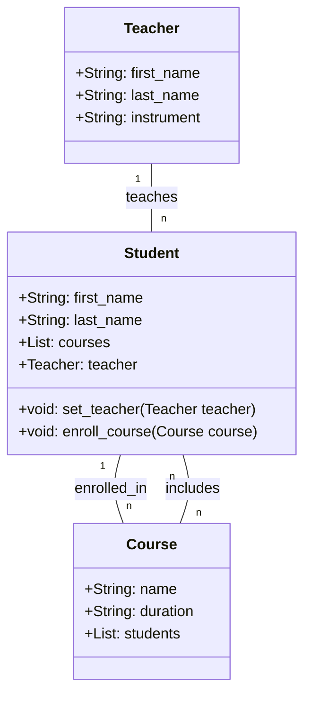

```mermaid

classDiagram

    class Teacher {
        +String: first_name
        +String: last_name
        +String: instrument
    }

    class Student {
        +String: first_name
        +String: last_name
        +List<Course>: courses
        +Teacher: teacher
        +void: set_teacher(Teacher teacher)
        +void: enroll_course(Course course)
    }

    class Course {
        +String: name
        +String: duration
        +List<Student>: students
    }
    
    Teacher "1" -- "n" Student : teaches
    Student "1" -- "n" Course : enrolled_in
    Course "n" -- "n" Student : includes
```