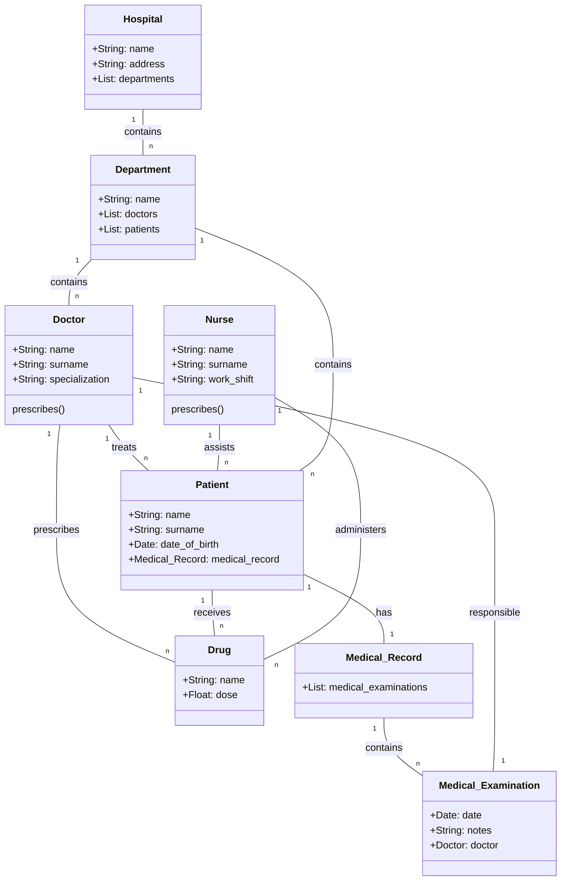

```mermaid

classDiagram

    class Doctor {
        +String: name
        +String: surname
        +String: specialization
        prescribes()
    }

    class Drug {
        +String: name
        +Float: dose
    }

    class Hospital {
        +String: name
        +String: address
        +List<Department>: departments
    }
    
    class Department {
        +String: name 
        +List<Doctor>: doctors 
        +List<Patient>: patients 
    } 
    
    class Patient { 
        +String: name 
        +String: surname 
        +Date: date_of_birth 
        +Medical_Record: medical_record 
    }
    
    class Nurse {
        +String: name 
        +String: surname 
        +String: work_shift
        prescribes()
    }
    
    class Medical_Record { 
        +List<Medical_Examination>: medical_examinations
    } 
    
    class Medical_Examination { 
        +Date: date 
        +String: notes 
        +Doctor: doctor 
    }
    
    Doctor "1" -- "n" Patient : treats
    Doctor "1" -- "n" Drug : prescribes
    Patient "1" -- "n" Drug : receives
    Nurse "1" -- "n" Patient : assists
    Nurse "1" -- "n" Drug : administers
    Department "1" -- "n" Doctor : contains
    Department "1" -- "n" Patient : contains
    Hospital "1" -- "n" Department : contains
    Patient "1" -- "1" Medical_Record : has
    Medical_Record "1" -- "n" Medical_Examination : contains
    Medical_Examination "1" -- "1" Doctor : responsible
```