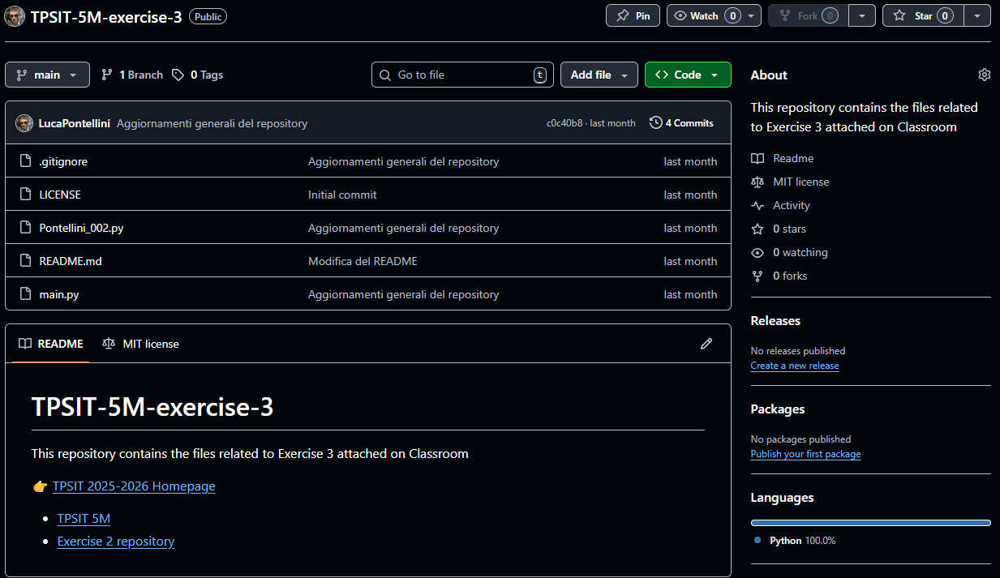
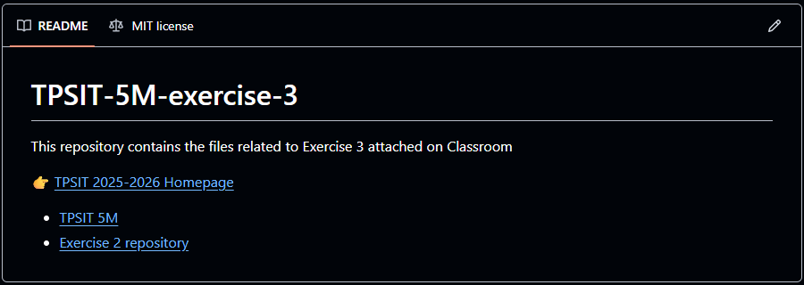
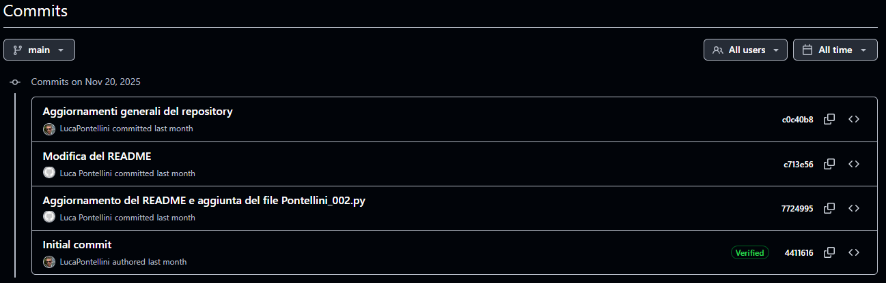

##  Repository: TPSIT-5M-exercise-3
### visione generale:
Questo Repository contiene **l’ultimo lavoro versionato** tramite *GIT* e pubblicato sul mio account **GitHub**. Il repository è stato creato per raccogliere e organizzare i file relativi all’**Esercizio 3** assegnato su *Classroom*.

---


##  Contenuto del progetto:
Il repository include:
- File Python richiesti dalla consegna su *Classroom*.
- Un file **README.md** con la descrizione generale del progetto  
- Collegamenti ad altri repository correlati del corso *TPSIT*  

Al suo interno sono presenti riferimenti utili come:
- il repository principale di *TPSIT*
- gli esercizi precedenti  
- la homepage del corso  

### Contenuto del README:



### Codice in Markdown (.md) del contenuto del Repository:

```
# TPSIT-5M-exercise-3
This repository contains the files related to Exercise 3 attached on Classroom

👉 [TPSIT 2025-2026 Homepage](https://github.com/LucaPontellini/Homepage/tree/2425f47dbce8a3d696b747f330d7e43846ce0315/TPSIT/2025-2026)

- [TPSIT 5M](https://github.com/LucaPontellini/TPSIT-5M)
- [Exercise 2 repository](https://github.com/LucaPontellini/TPSIT-5M-exercise-2)
```

---


##  Link utilizzabili:
- 👉 **TPSIT 2025-2026 Homepage** 
  https://github.com/LucaPontellini/Homepage/tree/2425f47dbce8a3d696b747f330d7e43846ce0315/TPSIT/2025-2026

-  **TPSIT 5M**  
  https://github.com/LucaPontellini/TPSIT-5M

-  **Exercise 2 repository**  
  https://github.com/LucaPontellini/TPSIT-5M-exercise-2

---


##  Versionamento con Git e storico del Repository:
Il lavoro è stato gestito tramite **GIT**, permettendo di:
- tenere traccia delle modifiche nel tempo 
- visualizzare lo *storico dei commit*  
- garantire un corretto versionamento del codice  

Questo approccio consente una migliore organizzazione del lavoro e una facile collaborazione per le persone che possono collaborare con me[^1].

[^1]: Il versionamento consente di recuperare versioni precedenti del progetto.

### Storico del repository (elenco dei commit):
 

##  Link al repository GitHub:
 **Repository TPSIT-5M-exercise-3** : https://github.com/LucaPontellini/TPSIT-5M-exercise-3.git

---

## Checklist di verifica del Repository:

### Struttura del progetto:
- [x] È presente un file **README.md** con la descrizione del progetto  
- [ ] La struttura delle cartelle è chiara e organizzata  
- [x] I file sono nominati correttamente e senza spazi o caratteri speciali  
- [ ] Sono presenti eventuali file `.gitignore` per escludere elementi non necessari  

### Contenuto del codice:
- [x] Il codice è scritto in modo leggibile e commentato  
- [x] Sono rispettate le standardizzazioni (indentazione, nomi di variabili, funzioni, ecc.)  
- [x] Non ci sono errori di sintassi  
- [x] Sono presenti esempi di esecuzione o test  

### Versionamento con Git:
- [x] Lo storico dei commit è aggiornato e significativo  
- [ ] I messaggi dei commit sono chiari e descrittivi  
- [x] È stato creato almeno un **branch** oltre a `main` per lo sviluppo  
- [x] Sono stati effettuati merge corretti senza conflitti irrisolti  

### Documentazione:
- [x] Il README contiene link ad altri repository correlati  
- [ ] Sono presenti istruzioni per l’installazione o l’esecuzione del progetto  
- [ ] È indicata la versione del linguaggio o degli strumenti utilizzati  
- [x] Sono presenti eventuali note a piè di pagina per chiarimenti aggiuntivi  

### Collaborazione:
- [x] Il repository è pubblico o condiviso con i collaboratori  
- [ ] Sono definiti i ruoli o le responsabilità dei membri del gruppo  
- [ ] È presente una sezione con le regole di contributo (`CONTRIBUTING.md`)  
- [x] È stato configurato un file di licenza (`LICENSE`)  

### Controllo finale:
- [x] Tutti i link funzionano correttamente  
- [x] Non ci sono file temporanei o inutili nel repository  
- [x] Il progetto è stato testato almeno una volta con successo  
- [x] Il repository è pronto per la consegna o la pubblicazione 